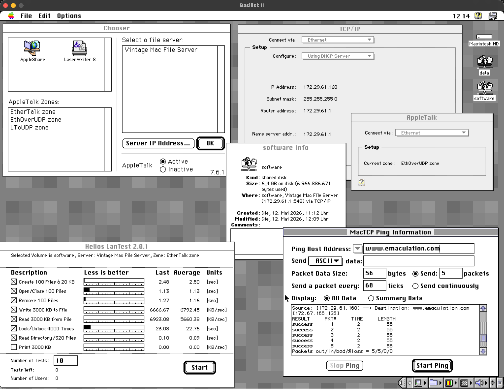
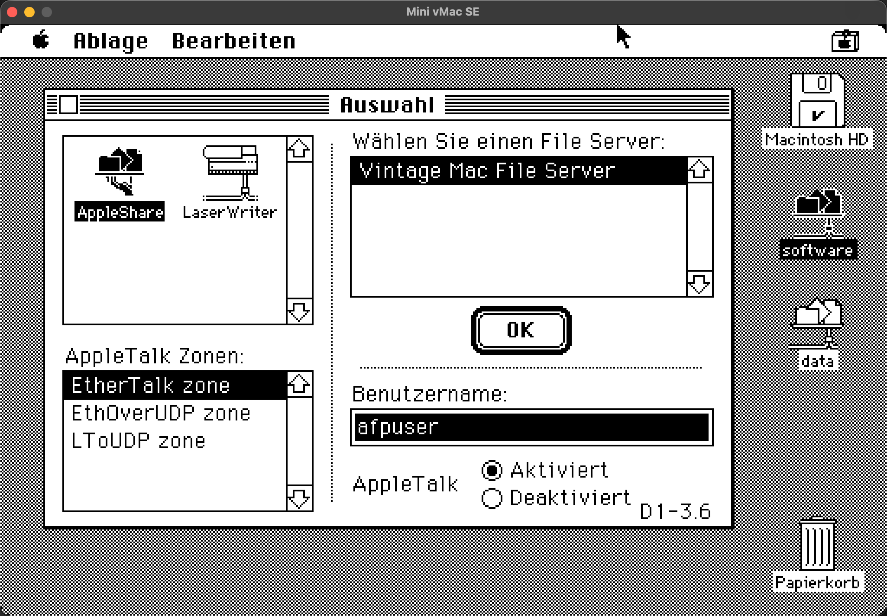

# Vintage Mac Server

**IMPORTANT: This is not meant as a "ready to deploy and run" project. The purpose is to give some hints about how a compact communication server for vintage Macs (physical and virtual) could look.**

## Features

- LocalTalk
- EtherTalk
- AppleTalk routing
- IP routing and masquerading
- AFP file server
- DNS
- DHCP

### Networking

This machine sits at the intersection of four independent networks. Together they enable modern infrastructure, legacy hardware connectivity, and tunnelled virtual networking to coexist on a single host.

The setup features 4 networks: 
- Two of them with real interfaces: These exist because I wanted to have the possibility to separate the vintage Mac traffic (which stems from the time where networks used to be innocent) from today's ordinary LAN traffic.
- Two overlay/tunnel networks.

Bridging and routing services are provided. See [networking](networking.md) and [host subdir](host/) for more details

---
## Supported emulators

All emulators were run on MacBook Neo, MacOS Tahoe 26.4.1. Host connectivity was WiFi.

| Emulator    | Tested  | System | Net SW | Connection | Via |
|-------------|---------|--------|--------|------------|-----|
| Mini vMac   | &#9989; | 6.0.7 | Classic | LocalTalk | ltoudp |
| Basilisk II | &#9989; | 7.5.5 | OpenTransport 1.3 | EtherTalk+TCP/IP | ethoudp |

SheepShaver should work similar to Basilisk II but is currently untested.

## Supported real Macs

Currently all untested. A Mac SE and a Mac IIci are waiting to be recaped.

---
---
# Setup description

## Host requirements
The current setup uses:
- Physical or virtual machine (mine is running on a [Proxmox](https://www.proxmox.com/) server)
- Two separate Ethernet connections
    - should be separate broadcast domains
    - can be real network cards or VLANs on the same physical network
- Debian Trixie
    - no GUI installed
    - Docker installed

Using Docker here is debatable, especially because the containers require many privileges.
It's just my personal preference for keeping dependencies separate between applications.
So YMMV.

## vmacsrv setup procedure
1. On the host itself, provide the basic network infrastructure. See [host subdir](host/).
1. For DNS and DHCP, provide a container as described in [dnsmasq subdir](dnsmasq/).
1. For AFP file services and EtherTalk routing, provide a container as described in [netatalk subdir](netatalk/).
1. For Ethernet-over-UDP for SheepShaver/Basilisk II, provide a container as described in [ethoudp_iface subdir](ethoudp_iface/).
1. For LocalTalk-over-UDP, provide a container as described in [ltoudp_router subdir](ltoudp_router/).
1. For IP routing, provide a container as described in [vmacsrv-ip-router subdir](vmacsrv-ip-router/).

## Emulator setup

### Basilisk II

- Run on a machine placed in `lan`
- In your prefs file:
    - Set `udptunnel true`
    - Set `udpport 6066`
    - Remove all `ether` options

### Mini vMac

- Run on a machine placed in `lan`
- Machine maybe needs to be a Mac, but I'm not sure
- Compile time options:
    - Use Mini vMac branch 37: `-br 37`
    - Enable LocalTalk support `-lt`

---
---
# Screenshots

## Basilisk II running 7.5.5

What's in the screenshot:
- Machine runs System 7.5.5
- All three AppleTalk zones visible
- Machine is placed in "EthOverUDP zone"
- TCP/IP configured via DHCP
- File server visible in chooser
- Two volumes mounted via AFP over TCP/IP
- Helios LanTest performance results on file server
- Working IP routing to internet

## Mini vMac running 6.0.7

What's in the screenshot:
- Machine runs System 6.0.7
- All three AppleTalk zones visible
- File server visible in chooser
- Two volumes mounted (via AFP over LocalTalk)
